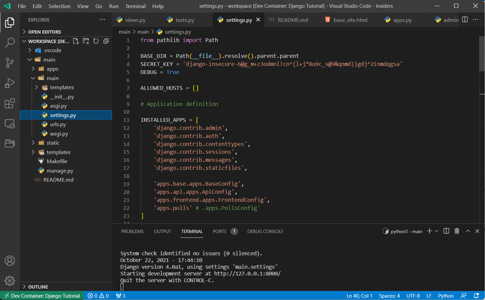

# Tutorial: Create a Django App with VS Code and DevContainers

This Repository contains a django app created by following the polls app tutorial fro the django documentation.

We use the DevContainer feature from Visual Studio Code to use a python environment running in a docker container.

## Create App

```
$ django-admin  startproject main
$ cd main
```

```
$ mkdir -p apps/{base,frontend,api}
$ django-admin startapp base     apps/base
$ django-admin startapp frontend apps/frontend
$ django-admin startapp api      apps/api
$ django-admin startapp polls    apps/polls
```

```
$ python3 manage.py  migrate
$ python3 manage.py  createsuperuser --username admin --email admin@via-internet.de

```
## Create Polls App

```
$ mkdir -p apps/polls
$ django-admin  startapp api apps/api/
```

```
....
```


```
python3 manage.py makemigrations polls
python3 manage.py sqlmigrate polls 0001

```
$
```